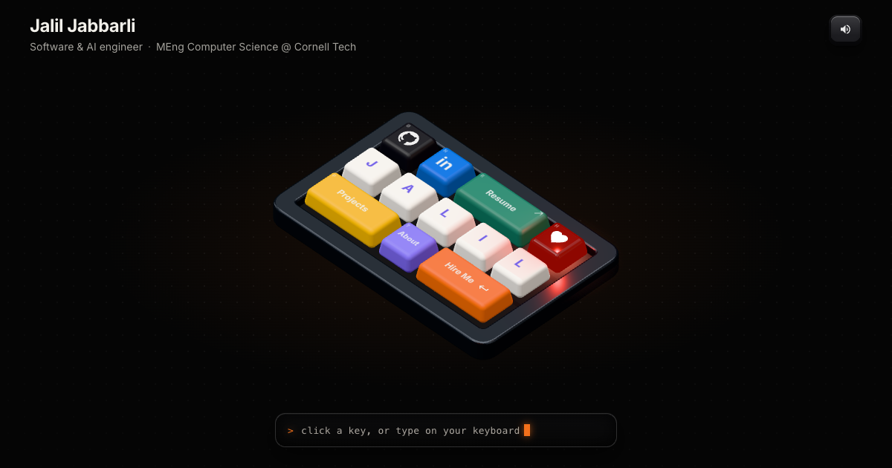

# Jalil Jabbarli · Portfolio

My portfolio is a 3D mechanical keyboard. Every link is a key you can press.

**Live:** https://jaliljabbarli.vercel.app



## Keys

| Key | What it does | Physical key |
| --- | --- | --- |
| **J A L I L** | Types my name on the little display (type the whole thing for a surprise) | `J` `A` `L` `I` |
| **Projects** | Opens the projects panel (`/projects`) | `P` |
| **About** | Experience, education and skills (`/about`) | `?` |
| **Resume** | Opens the PDF | `R` |
| **GitHub** | github.com/Jalil-g | `G` |
| **in** | LinkedIn | `N` |
| **Hire Me ↵** | Opens an email to me | `Enter` |
| **♥** | Hearts | `H` |

`Esc` closes a panel.

## Features

- **Real 3D, built in code.** The keycaps, the machined case and the lighting are generated with three.js and React Three Fiber. Nothing comes from an external scene file.
- **Works on phones.** Below ~620px or in portrait, the keys reflow from a 5×3 board into a 3×5 one and the camera angle steepens, so every key is big enough to tap. The camera always fits the board between the header and the display.
- **Sounds like a clicky switch.** Each press is synthesized with Web Audio: a click-leaf snap, then the bottom-out on the plate, then a softer upstroke on release. Wide keys add stabilizer rattle. There are no audio files, and a mute toggle is in the corner.
- **Type on your own keyboard.** Keys go down as you type.
- **Accessible.** Hidden, focusable links mirror every key for screen readers and the Tab key; focusing one lights up its keycap. Browsers without WebGL get a flat HTML keyboard, and `prefers-reduced-motion` turns off the intro animation and floating.
- **Fast first paint.** The header and display render immediately while the 3D scene (three.js) loads as a separate chunk.

## Editing content

Everything personal lives in [`src/data/profile.ts`](src/data/profile.ts): links, email, projects, experience and skills. Keys and both layouts are in [`src/keyboard/keys.ts`](src/keyboard/keys.ts). To add a key, add an entry to `KEYS` and give it a slot in `LAYOUTS.wide` and `LAYOUTS.tall`.

Project screenshots go in `public/images/` (WebP, ~1400px wide). A project without an image gets a generated keycap cover.

## Development

```bash
npm install
npm run dev      # http://localhost:5173
npm run build    # type-check + production build into dist/
npm run lint
```

Deployed on Vercel. `vercel.json` rewrites every route to `index.html` so `/projects` and `/about` work on refresh.

## Stack

React 19 · TypeScript · Vite · three.js · @react-three/fiber · @react-three/drei · Web Audio API

## Project structure

```
src/
  data/profile.ts        content: links, projects, experience, skills
  keyboard/
    keys.ts              key definitions + wide/tall layouts
    actions.ts           what each key does
    geometry.ts          sculpted keycaps, case and tray
    Key.tsx              one keycap: press/hover/intro animation, legends
    Keyboard.tsx         the board, case resizing, float + parallax
    Scene.tsx            canvas, camera auto-fit, lighting
  lib/
    sound.ts             synthesized mechanical switch sounds
    store.ts, router.ts  tiny state store and history router
  ui/                    header, display, panels, HTML keycaps, fallback keyboard
```
